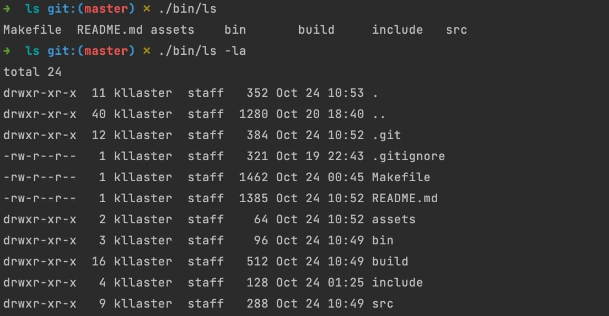

# ls



## Description

In Linux, the command "ls" is one of the most commonly used.
It's used to display a list of files and sub-directories.
And this project is my implementation of this command.

The ability to view what files are in a directory is what makes ls so important. 
It will be used frequently to display directory contents. 
Although it is not a complicated command, it does come with a number of options for listing files with additional information. 
Even while ls is always enough to list contents, you're likely to find a few of these options highly handy.

See original "ls" - [man](https://man7.org/linux/man-pages/man1/ls.1.html).

## Features

### Flags:
+ `-a` Do not ignore entries starting with `.`
+ `-R` List subdirectories recursively
+ `-l` Use a long listing format
+ `-t` Sort by time, newest first
+ `-r` Reverse order while sorting

## Usage
### Installation Instructions
1. Cloning this repository
    ```commandline
    git clone https://github.com/Kllaster/ls.git
    ```

2. `cd` into the root directory
    ```commandline
    cd ls
    ```

3. Creating a program from source code
    ```commandline
    make
    ```

### Execute command
   ```commandline
   ./bin/ls [option]... [file]...
   ```